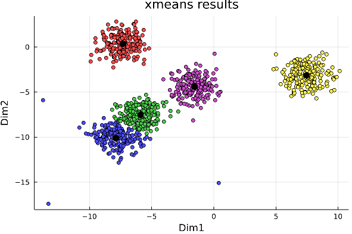
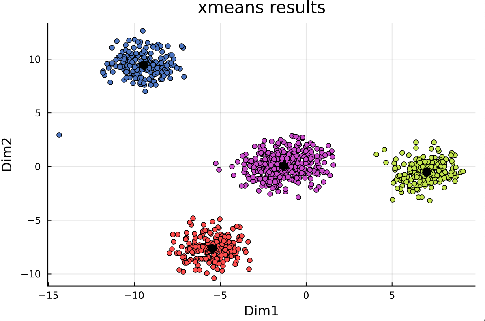

# **Julia ML-Clustering project by x-means**
  ## **Xmeans**
  - Currently, the best algorithm I used to cluster the data due to no need to decide the cluster count. 
----
  ## **Data format**
  - iris by RDatasets package
  - gaussian distribution by make_blobs from MLJ packages
----
  ## **Reference**
  - https://github.com/KazuhisaFujita/X-means                   
  - Extending K-means with Efficient Estimation of the Number of Clusters, D. Pelleg and A. Moore (2000)
----
  ## **How to work**
  - julia xmeans.jl
  - julia xmeans.jl -k 1 -K 10 -D "make_blobs"
      - -k / --kmin      -> minimum k value for xmeans
      - -K / --kmax      -> maximum k value for xmeans
      - -D / --data_type -> data type for xmeans
----
  ## **Results**
  -  
  -  
