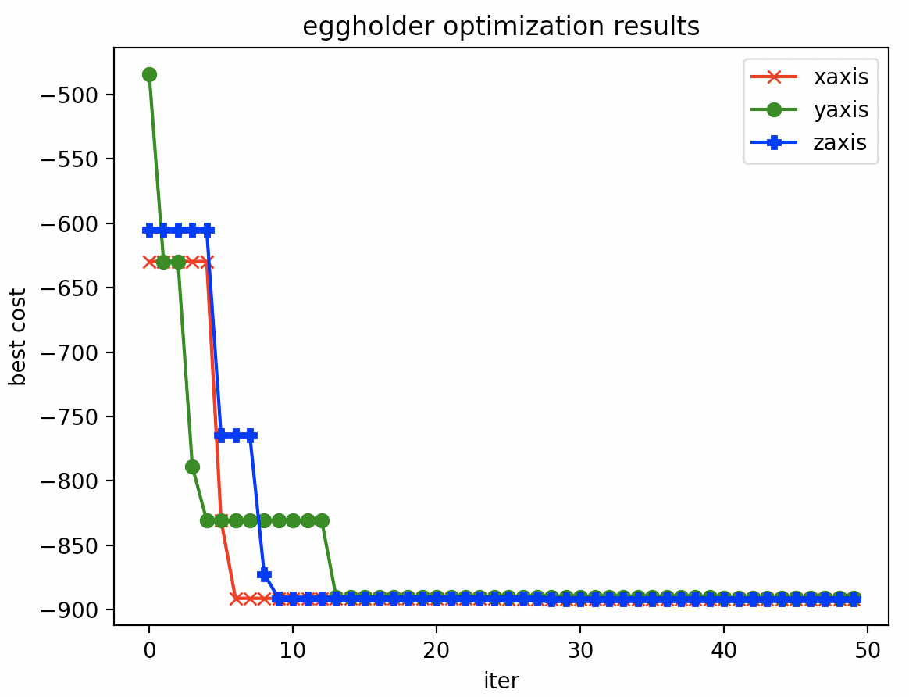
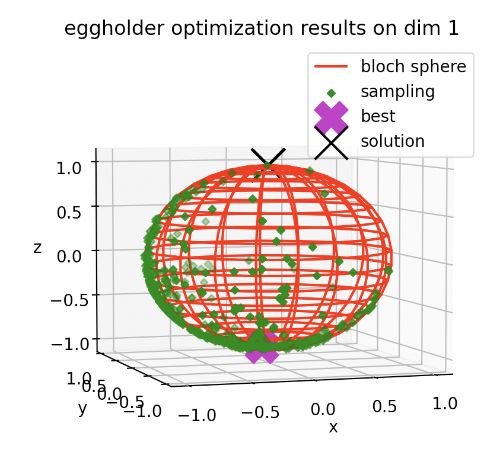
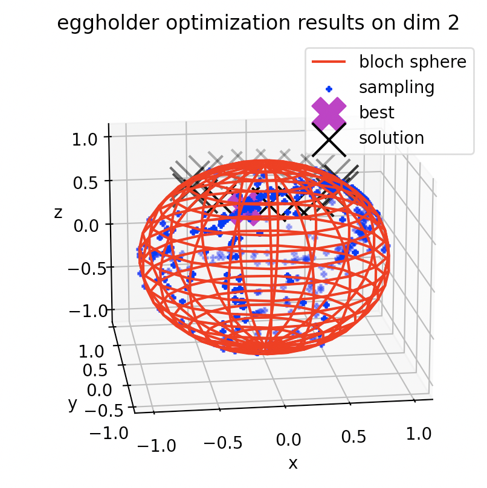
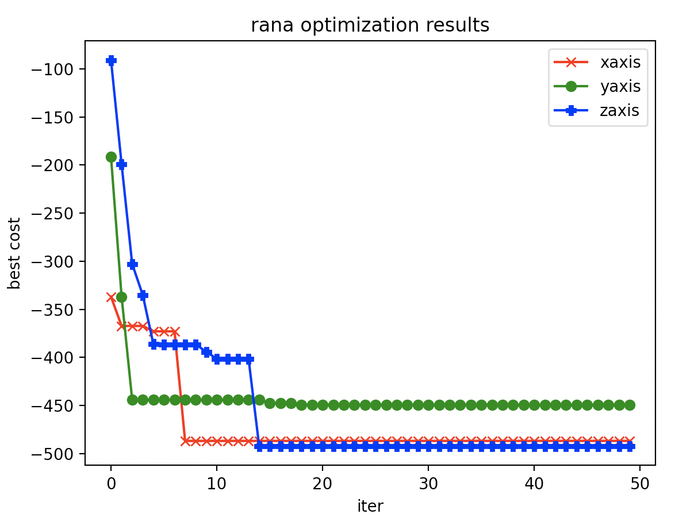
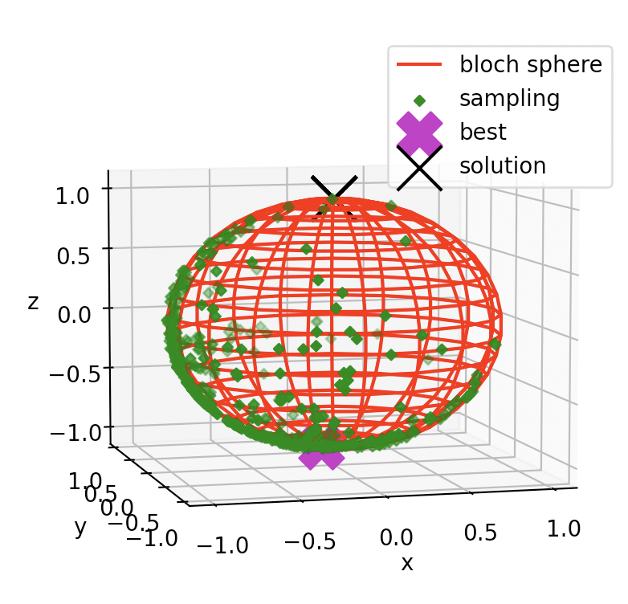
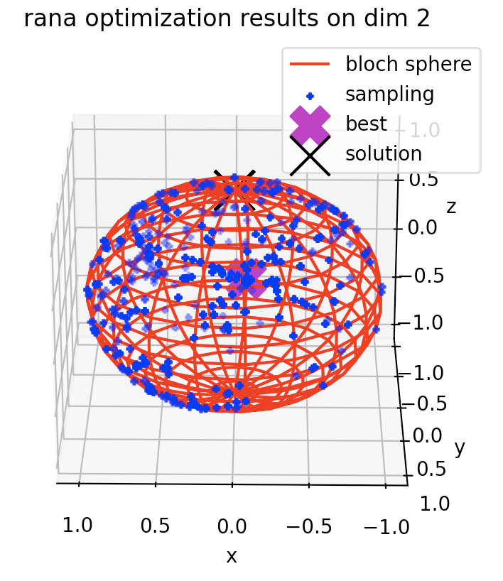
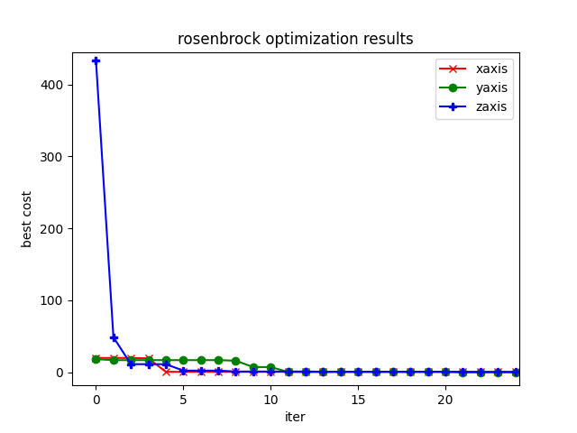
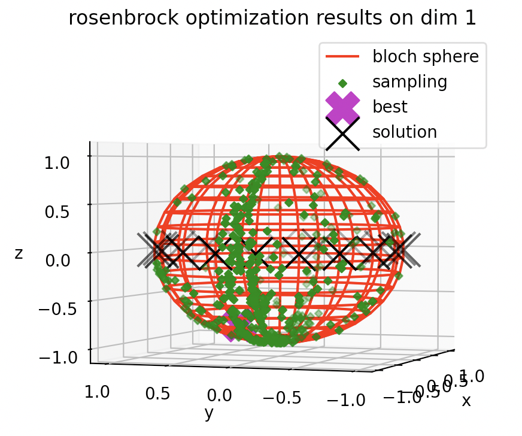
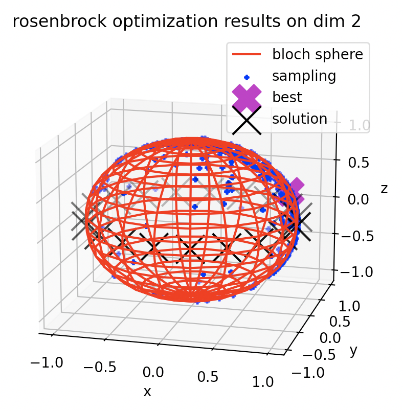

# **Julia QIDEA Optimization by Quamtum-inspired Differential Evolution Algorithm**
  ## **QIDEA(Quantum-Insipired Differential Evolution Algorithm)**
  - There are three method on heurestic optimization by quantum-inspired algorithm, swarm, evolution and physical based method. After studied the quantum-inspired partical swarm method, here is that I tried to use julia program to implement the differential evolution combined with quantum-inspired evolution algorithm. Use the qubits to map the real parameter and opterated the differential part by bloch sphere space. Otherwise, use hadamard gate to rotate the qubit to be the mutation part for more exploration and avoid to permature convergence.
   
  ## **Optimized function(2D)**
  - rosenbrock with initial bound (-10, 10) 
  - eggholder  with initial bound (-512, 512)
----
  ## **Reference**
  - "Quantum Inspired Differential Evolution Algorithm", Binxu Li, Panchi Li
  - "A quantum-behaved evolutionary algorithm based on the Bloch spherical search",  Panchi Li

----
  ## **How to work**
  - julia QBEA.jl
----
  ## **Results**
  - eggholder function after optimized results
    - 
    - 
    - 
  - rana function after optimized results
    - 
    - 
    - 
  - rosenbrock function after optimized results 
    - 
    - 
    - 

