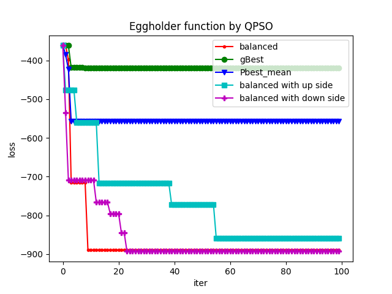
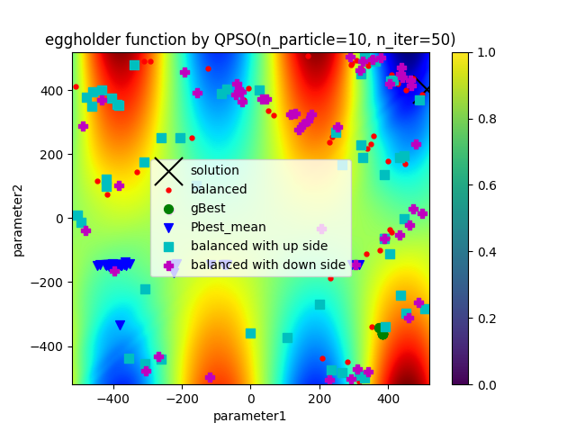
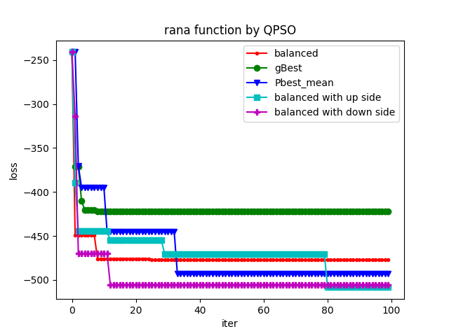
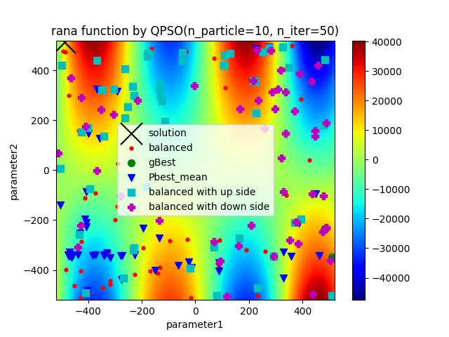
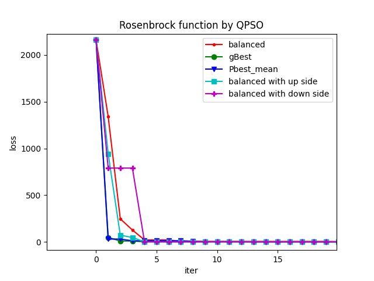
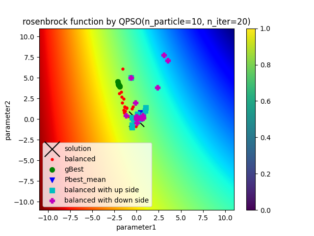

# **Julia QPSO Optimization by Quamtum-inspired Computing **
  ## **QPSO(Quantum Particle Swarm Optimization)**
  - Tried to implement this algorithm by Julia. Currently, the QPSO with balanced-global-attractor and down-side nonlinear weight strategy got the better results. Otherwise, the exploration of optimized parameter by balanced-global-attractor method is better than the attractor by group-best and particle-best method. 
----
  ## **Optimized function(2D)**
  - rosenbrock with initial bound (-10, 10) 
  - eggholder  with initial bound (-512, 512)
----
  ## **Reference**
  - https://github.com/SaTa999/pyQPSO
  - https://github.com/ngroup/qpso
  - "Quantum-behaved Particle Swarm Optimization with Novel Adaptive Strategies", 
----
  ## **How to work**
  - julia qpso.jl
----
  ## **Results**
  - eggholder function after optimized results
    - 
    - 
  - rana function after optimized results
    - 
    - 
  - rosenbrock function after optimized results 
    - 
    - 

